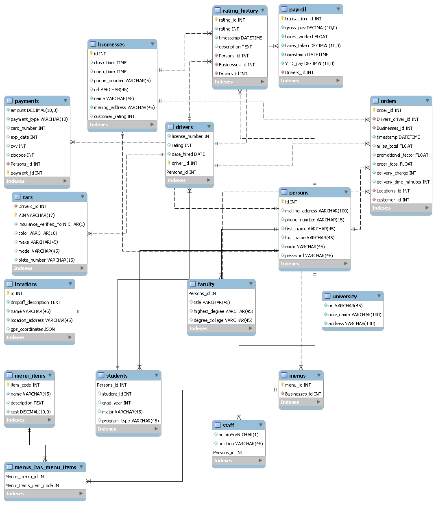
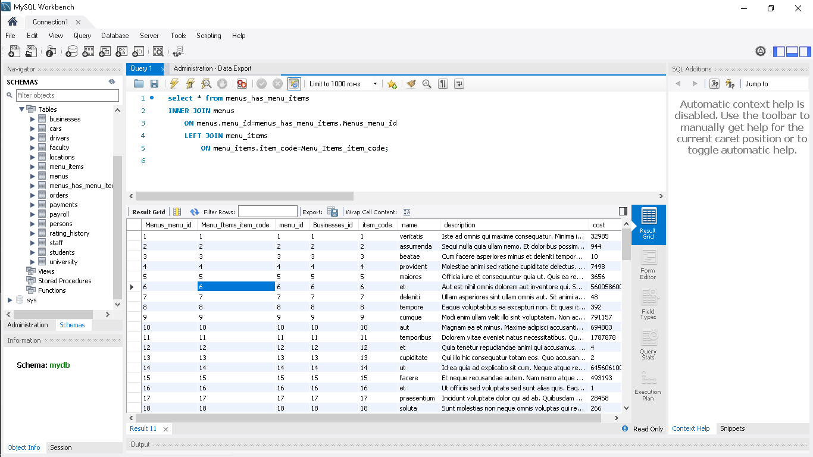

# ITCS3160PROJECT
<head>

</head>
<body>
Project for Database course

Cody Liske

TOC
<ul>
  <li>Introduction</li>
  <li>Business Rules</li>
  <li>EERD</li>
  <li>Data Dictionary</li>
  <li>Mysql Queries</li>
</ul>

<h1>
Introduction
</h1>

The objective of this project is to design and implement a database for an on-campus food delivery service that hires drivers from the UNCC student body to pick up and deliver food items to faculty, staff, and other students. The database should be capable of supporting a web application that allows persons to add menu items from a food establishment to a cart and place an order, as well as assigning and dispatching drivers on deliveries. The database should provide capability for record keeping of placed orders and rating history for both drivers and businesses.

<h1>
Business Rules
</h1>

<ul>
  <li>Drivers can only be students, all persons can place an order</li>
  <li>Persons can place 0 to many orders, orders can only be from one business</li>
  <li>Orders can have 1 or many items</li>
  <li>Persons can rate driver and business</li>
  <li>Delivery charge is a flat rate, can be changed during promotions</li>
  <li>Orders have to be delivered at one of a set of specified locations</li>
  <li>Only one customer and one driver can be tied to an order</li>
</ul>

<h1>
EERD
</h1>

<h1>
  Data Dictionary
</h1>

<h2>Schema Report for database: mydb</h2>
<a id="home">Table List </a> <ul>
<li><a href="#businesses">businesses </a></li>
<li><a href="#cars">cars </a></li>
<li><a href="#drivers">drivers </a></li>
<li><a href="#faculty">faculty </a></li>
<li><a href="#locations">locations </a></li>
<li><a href="#menu_items">menu_items </a></li>
<li><a href="#menus">menus </a></li>
<li><a href="#menus_has_menu_items">menus_has_menu_items </a></li>
<li><a href="#orders">orders </a></li>
<li><a href="#payments">payments </a></li>
<li><a href="#payroll">payroll </a></li>
<li><a href="#persons">persons </a></li>
<li><a href="#rating_history">rating_history </a></li>
<li><a href="#staff">staff </a></li>
<li><a href="#students">students </a></li>
<li><a href="#university">university </a></li>
</ul>
<table style="width:100%"><caption>Table: businesses </caption>
<tr><td>Table Comments</td><td colspan="6"></td></tr>
<tr><td colspan="7">Columns</td></tr>
        <tr>
        <th>Name</th>
        <th>Data Type</th>
        <th>Nullable</th>
        <th>PK</th>
        <th>FK</th>
        <th>Default</th>
        <th>Comment</th>
        </tr>
<tr><td>id</td><td>INT</td><td>Yes</td><td>Yes</td><td>No</td><td></td><td></td></tr>
<tr><td>close_time</td><td>TIME</td><td>No</td><td>No</td><td>No</td><td>NULL</td><td></td></tr>
<tr><td>open_time</td><td>TIME</td><td>No</td><td>No</td><td>No</td><td>NULL</td><td></td></tr>
<tr><td>phone_number</td><td>VARCHAR(5)</td><td>No</td><td>No</td><td>No</td><td>NULL</td><td></td></tr>
<tr><td>url</td><td>VARCHAR(45)</td><td>No</td><td>No</td><td>No</td><td>NULL</td><td></td></tr>
<tr><td>name</td><td>VARCHAR(45)</td><td>Yes</td><td>No</td><td>No</td><td></td><td></td></tr>
<tr><td>mailing_address</td><td>VARCHAR(45)</td><td>Yes</td><td>No</td><td>No</td><td></td><td></td></tr>
<tr><td>customer_rating</td><td>INT</td><td>No</td><td>No</td><td>No</td><td>NULL</td><td></td></tr>
</table><a href="#home">Table List </a> 
<table style="width:100%"><caption>Table: cars </caption>
<tr><td>Table Comments</td><td colspan="6"></td></tr>
<tr><td colspan="7">Columns</td></tr>
        <tr>
        <th>Name</th>
        <th>Data Type</th>
        <th>Nullable</th>
        <th>PK</th>
        <th>FK</th>
        <th>Default</th>
        <th>Comment</th>
        </tr>
<tr><td>Drivers_id</td><td>INT</td><td>Yes</td><td>No</td><td>Yes</td><td></td><td></td></tr>
<tr><td>VIN</td><td>VARCHAR(17)</td><td>Yes</td><td>Yes</td><td>No</td><td></td><td></td></tr>
<tr><td>insurance_verified_YorN</td><td>CHAR(1)</td><td>Yes</td><td>No</td><td>No</td><td></td><td></td></tr>
<tr><td>color</td><td>VARCHAR(10)</td><td>No</td><td>No</td><td>No</td><td>NULL</td><td></td></tr>
<tr><td>make</td><td>VARCHAR(45)</td><td>No</td><td>No</td><td>No</td><td>NULL</td><td></td></tr>
<tr><td>model</td><td>VARCHAR(45)</td><td>No</td><td>No</td><td>No</td><td>NULL</td><td></td></tr>
<tr><td>plate_number</td><td>VARCHAR(15)</td><td>Yes</td><td>No</td><td>No</td><td></td><td></td></tr>
</table><a href="#home">Table List </a> 
<table style="width:100%"><caption>Table: drivers </caption>
<tr><td>Table Comments</td><td colspan="6"></td></tr>
<tr><td colspan="7">Columns</td></tr>
        <tr>
        <th>Name</th>
        <th>Data Type</th>
        <th>Nullable</th>
        <th>PK</th>
        <th>FK</th>
        <th>Default</th>
        <th>Comment</th>
        </tr>
<tr><td>license_number</td><td>INT</td><td>Yes</td><td>No</td><td>No</td><td></td><td></td></tr>
<tr><td>rating</td><td>INT</td><td>No</td><td>No</td><td>No</td><td>NULL</td><td></td></tr>
<tr><td>date_hired</td><td>DATE</td><td>Yes</td><td>No</td><td>No</td><td></td><td></td></tr>
<tr><td>driver_id</td><td>INT</td><td>Yes</td><td>Yes</td><td>No</td><td></td><td></td></tr>
<tr><td>Persons_id</td><td>INT</td><td>Yes</td><td>Yes</td><td>Yes</td><td></td><td></td></tr>
</table><a href="#home">Table List </a> 
<table style="width:100%"><caption>Table: faculty </caption>
<tr><td>Table Comments</td><td colspan="6"></td></tr>
<tr><td colspan="7">Columns</td></tr>
        <tr>
        <th>Name</th>
        <th>Data Type</th>
        <th>Nullable</th>
        <th>PK</th>
        <th>FK</th>
        <th>Default</th>
        <th>Comment</th>
        </tr>
<tr><td>Persons_id</td><td>INT</td><td>Yes</td><td>Yes</td><td>Yes</td><td></td><td></td></tr>
<tr><td>title</td><td>VARCHAR(45)</td><td>No</td><td>No</td><td>No</td><td>NULL</td><td></td></tr>
<tr><td>highest_degree</td><td>VARCHAR(45)</td><td>No</td><td>No</td><td>No</td><td>NULL</td><td></td></tr>
<tr><td>degree_college</td><td>VARCHAR(45)</td><td>No</td><td>No</td><td>No</td><td>NULL</td><td></td></tr>
</table><a href="#home">Table List </a> 
<table style="width:100%"><caption>Table: locations </caption>
<tr><td>Table Comments</td><td colspan="6"></td></tr>
<tr><td colspan="7">Columns</td></tr>
        <tr>
        <th>Name</th>
        <th>Data Type</th>
        <th>Nullable</th>
        <th>PK</th>
        <th>FK</th>
        <th>Default</th>
        <th>Comment</th>
        </tr>
<tr><td>id</td><td>INT</td><td>Yes</td><td>Yes</td><td>No</td><td></td><td></td></tr>
<tr><td>dropoff_description</td><td>TEXT</td><td>Yes</td><td>No</td><td>No</td><td></td><td></td></tr>
<tr><td>name</td><td>VARCHAR(45)</td><td>Yes</td><td>No</td><td>No</td><td></td><td></td></tr>
<tr><td>location_address</td><td>VARCHAR(45)</td><td>Yes</td><td>No</td><td>No</td><td></td><td></td></tr>
<tr><td>gps_coordinates</td><td>JSON</td><td>No</td><td>No</td><td>No</td><td>NULL</td><td></td></tr>
</table><a href="#home">Table List </a> 
<table style="width:100%"><caption>Table: menu_items </caption>
<tr><td>Table Comments</td><td colspan="6"></td></tr>
<tr><td colspan="7">Columns</td></tr>
        <tr>
        <th>Name</th>
        <th>Data Type</th>
        <th>Nullable</th>
        <th>PK</th>
        <th>FK</th>
        <th>Default</th>
        <th>Comment</th>
        </tr>
<tr><td>item_code</td><td>INT</td><td>Yes</td><td>Yes</td><td>No</td><td></td><td></td></tr>
<tr><td>name</td><td>VARCHAR(45)</td><td>Yes</td><td>No</td><td>No</td><td></td><td></td></tr>
<tr><td>description</td><td>TEXT</td><td>No</td><td>No</td><td>No</td><td>NULL</td><td></td></tr>
<tr><td>cost</td><td>DECIMAL(10,0)</td><td>Yes</td><td>No</td><td>No</td><td></td><td></td></tr>
</table><a href="#home">Table List </a> 
<table style="width:100%"><caption>Table: menus </caption>
<tr><td>Table Comments</td><td colspan="6"></td></tr>
<tr><td colspan="7">Columns</td></tr>
        <tr>
        <th>Name</th>
        <th>Data Type</th>
        <th>Nullable</th>
        <th>PK</th>
        <th>FK</th>
        <th>Default</th>
        <th>Comment</th>
        </tr>
<tr><td>menu_id</td><td>INT</td><td>Yes</td><td>Yes</td><td>No</td><td></td><td></td></tr>
<tr><td>Businesses_id</td><td>INT</td><td>Yes</td><td>No</td><td>Yes</td><td></td><td></td></tr>
</table><a href="#home">Table List </a> 
<table style="width:100%"><caption>Table: menus_has_menu_items </caption>
<tr><td>Table Comments</td><td colspan="6"></td></tr>
<tr><td colspan="7">Columns</td></tr>
        <tr>
        <th>Name</th>
        <th>Data Type</th>
        <th>Nullable</th>
        <th>PK</th>
        <th>FK</th>
        <th>Default</th>
        <th>Comment</th>
        </tr>
<tr><td>Menus_menu_id</td><td>INT</td><td>Yes</td><td>Yes</td><td>Yes</td><td></td><td></td></tr>
<tr><td>Menu_Items_item_code</td><td>INT</td><td>Yes</td><td>Yes</td><td>Yes</td><td></td><td></td></tr>
</table><a href="#home">Table List </a> 
<table style="width:100%"><caption>Table: orders </caption>
<tr><td>Table Comments</td><td colspan="6"></td></tr>
<tr><td colspan="7">Columns</td></tr>
        <tr>
        <th>Name</th>
        <th>Data Type</th>
        <th>Nullable</th>
        <th>PK</th>
        <th>FK</th>
        <th>Default</th>
        <th>Comment</th>
        </tr>
<tr><td>order_id</td><td>INT</td><td>Yes</td><td>Yes</td><td>No</td><td></td><td></td></tr>
<tr><td>Drivers_driver_id</td><td>INT</td><td>Yes</td><td>No</td><td>Yes</td><td></td><td></td></tr>
<tr><td>Businesses_id</td><td>INT</td><td>Yes</td><td>No</td><td>Yes</td><td></td><td></td></tr>
<tr><td>timestamp</td><td>DATETIME</td><td>Yes</td><td>No</td><td>No</td><td></td><td></td></tr>
<tr><td>miles_total</td><td>FLOAT</td><td>No</td><td>No</td><td>No</td><td>NULL</td><td></td></tr>
<tr><td>promotional_factor</td><td>FLOAT</td><td>No</td><td>No</td><td>No</td><td>NULL</td><td></td></tr>
<tr><td>order_total</td><td>FLOAT</td><td>Yes</td><td>No</td><td>No</td><td></td><td></td></tr>
<tr><td>delivery_charge</td><td>INT</td><td>Yes</td><td>No</td><td>No</td><td></td><td></td></tr>
<tr><td>delivery_time_minutes</td><td>INT</td><td>No</td><td>No</td><td>No</td><td>NULL</td><td></td></tr>
<tr><td>Locations_id</td><td>INT</td><td>Yes</td><td>No</td><td>Yes</td><td></td><td></td></tr>
<tr><td>customer_id</td><td>INT</td><td>Yes</td><td>No</td><td>Yes</td><td></td><td></td></tr>
</table><a href="#home">Table List </a> 
<table style="width:100%"><caption>Table: payments </caption>
<tr><td>Table Comments</td><td colspan="6"></td></tr>
<tr><td colspan="7">Columns</td></tr>
        <tr>
        <th>Name</th>
        <th>Data Type</th>
        <th>Nullable</th>
        <th>PK</th>
        <th>FK</th>
        <th>Default</th>
        <th>Comment</th>
        </tr>
<tr><td>amount</td><td>DECIMAL(10,0)</td><td>Yes</td><td>No</td><td>No</td><td></td><td></td></tr>
<tr><td>payment_type</td><td>VARCHAR(10)</td><td>Yes</td><td>No</td><td>No</td><td></td><td></td></tr>
<tr><td>card_number</td><td>INT</td><td>No</td><td>No</td><td>No</td><td>NULL</td><td></td></tr>
<tr><td>exp_date</td><td>INT</td><td>No</td><td>No</td><td>No</td><td>NULL</td><td></td></tr>
<tr><td>cvv</td><td>INT</td><td>No</td><td>No</td><td>No</td><td>NULL</td><td></td></tr>
<tr><td>zipcode</td><td>INT</td><td>No</td><td>No</td><td>No</td><td>NULL</td><td></td></tr>
<tr><td>Persons_id</td><td>INT</td><td>Yes</td><td>No</td><td>Yes</td><td></td><td></td></tr>
<tr><td>payment_id</td><td>INT</td><td>Yes</td><td>Yes</td><td>No</td><td></td><td></td></tr>
</table><a href="#home">Table List </a> 
<table style="width:100%"><caption>Table: payroll </caption>
<tr><td>Table Comments</td><td colspan="6"></td></tr>
<tr><td colspan="7">Columns</td></tr>
        <tr>
        <th>Name</th>
        <th>Data Type</th>
        <th>Nullable</th>
        <th>PK</th>
        <th>FK</th>
        <th>Default</th>
        <th>Comment</th>
        </tr>
<tr><td>transaction_id</td><td>INT</td><td>Yes</td><td>Yes</td><td>No</td><td></td><td></td></tr>
<tr><td>gross_pay</td><td>DECIMAL(10,0)</td><td>Yes</td><td>No</td><td>No</td><td></td><td></td></tr>
<tr><td>hours_worked</td><td>FLOAT</td><td>Yes</td><td>No</td><td>No</td><td></td><td></td></tr>
<tr><td>taxes_taken</td><td>DECIMAL(10,0)</td><td>Yes</td><td>No</td><td>No</td><td></td><td></td></tr>
<tr><td>timestamp</td><td>DATETIME</td><td>Yes</td><td>No</td><td>No</td><td></td><td></td></tr>
<tr><td>YTD_pay</td><td>DECIMAL(10,0)</td><td>Yes</td><td>No</td><td>No</td><td></td><td></td></tr>
<tr><td>Drivers_id</td><td>INT</td><td>Yes</td><td>No</td><td>Yes</td><td></td><td></td></tr>
</table><a href="#home">Table List </a> 
<table style="width:100%"><caption>Table: persons </caption>
<tr><td>Table Comments</td><td colspan="6"></td></tr>
<tr><td colspan="7">Columns</td></tr>
        <tr>
        <th>Name</th>
        <th>Data Type</th>
        <th>Nullable</th>
        <th>PK</th>
        <th>FK</th>
        <th>Default</th>
        <th>Comment</th>
        </tr>
<tr><td>id</td><td>INT</td><td>Yes</td><td>Yes</td><td>No</td><td></td><td></td></tr>
<tr><td>mailing_address</td><td>VARCHAR(100)</td><td>No</td><td>No</td><td>No</td><td>NULL</td><td></td></tr>
<tr><td>phone_number</td><td>VARCHAR(15)</td><td>No</td><td>No</td><td>No</td><td>NULL</td><td></td></tr>
<tr><td>first_name</td><td>VARCHAR(45)</td><td>No</td><td>No</td><td>No</td><td>NULL</td><td></td></tr>
<tr><td>last_name</td><td>VARCHAR(45)</td><td>No</td><td>No</td><td>No</td><td>NULL</td><td></td></tr>
<tr><td>email</td><td>VARCHAR(45)</td><td>No</td><td>No</td><td>No</td><td>NULL</td><td></td></tr>
<tr><td>password</td><td>VARCHAR(45)</td><td>No</td><td>No</td><td>No</td><td>NULL</td><td></td></tr>
</table><a href="#home">Table List </a> 
<table style="width:100%"><caption>Table: rating_history </caption>
<tr><td>Table Comments</td><td colspan="6"></td></tr>
<tr><td colspan="7">Columns</td></tr>
        <tr>
        <th>Name</th>
        <th>Data Type</th>
        <th>Nullable</th>
        <th>PK</th>
        <th>FK</th>
        <th>Default</th>
        <th>Comment</th>
        </tr>
<tr><td>rating_id</td><td>INT</td><td>Yes</td><td>Yes</td><td>No</td><td></td><td></td></tr>
<tr><td>rating</td><td>INT</td><td>Yes</td><td>No</td><td>No</td><td></td><td></td></tr>
<tr><td>timestamp</td><td>DATETIME</td><td>Yes</td><td>No</td><td>No</td><td></td><td></td></tr>
<tr><td>description</td><td>TEXT</td><td>No</td><td>No</td><td>No</td><td>NULL</td><td></td></tr>
<tr><td>Persons_id</td><td>INT</td><td>Yes</td><td>No</td><td>Yes</td><td></td><td></td></tr>
<tr><td>Businesses_id</td><td>INT</td><td>Yes</td><td>No</td><td>Yes</td><td></td><td></td></tr>
<tr><td>Drivers_id</td><td>INT</td><td>Yes</td><td>No</td><td>Yes</td><td></td><td></td></tr>
</table><a href="#home">Table List </a> 
<table style="width:100%"><caption>Table: staff </caption>
<tr><td>Table Comments</td><td colspan="6"></td></tr>
<tr><td colspan="7">Columns</td></tr>
        <tr>
        <th>Name</th>
        <th>Data Type</th>
        <th>Nullable</th>
        <th>PK</th>
        <th>FK</th>
        <th>Default</th>
        <th>Comment</th>
        </tr>
<tr><td>adminYorN</td><td>CHAR(1)</td><td>No</td><td>No</td><td>No</td><td>NULL</td><td></td></tr>
<tr><td>position</td><td>VARCHAR(45)</td><td>No</td><td>No</td><td>No</td><td>NULL</td><td></td></tr>
<tr><td>Persons_id</td><td>INT</td><td>Yes</td><td>Yes</td><td>Yes</td><td></td><td></td></tr>
</table><a href="#home">Table List </a> 
<table style="width:100%"><caption>Table: students </caption>
<tr><td>Table Comments</td><td colspan="6"></td></tr>
<tr><td colspan="7">Columns</td></tr>
        <tr>
        <th>Name</th>
        <th>Data Type</th>
        <th>Nullable</th>
        <th>PK</th>
        <th>FK</th>
        <th>Default</th>
        <th>Comment</th>
        </tr>
<tr><td>Persons_id</td><td>INT</td><td>Yes</td><td>Yes</td><td>Yes</td><td></td><td></td></tr>
<tr><td>student_id</td><td>INT</td><td>No</td><td>No</td><td>No</td><td>NULL</td><td></td></tr>
<tr><td>grad_year</td><td>INT</td><td>No</td><td>No</td><td>No</td><td>NULL</td><td></td></tr>
<tr><td>major</td><td>VARCHAR(45)</td><td>No</td><td>No</td><td>No</td><td>NULL</td><td></td></tr>
<tr><td>program_type</td><td>VARCHAR(45)</td><td>No</td><td>No</td><td>No</td><td>NULL</td><td></td></tr>
</table><a href="#home">Table List </a> 
<table style="width:100%"><caption>Table: university </caption>
<tr><td>Table Comments</td><td colspan="6"></td></tr>
<tr><td colspan="7">Columns</td></tr>
        <tr>
        <th>Name</th>
        <th>Data Type</th>
        <th>Nullable</th>
        <th>PK</th>
        <th>FK</th>
        <th>Default</th>
        <th>Comment</th>
        </tr>
<tr><td>url</td><td>VARCHAR(45)</td><td>Yes</td><td>No</td><td>No</td><td></td><td></td></tr>
<tr><td>univ_name</td><td>VARCHAR(100)</td><td>Yes</td><td>No</td><td>No</td><td></td><td></td></tr>
<tr><td>address</td><td>VARCHAR(100)</td><td>Yes</td><td>No</td><td>No</td><td></td><td></td></tr>
</table>
<h1>
  MySQL Implementation
</h1>

The database design above was implemented in MySQL Workbench v.8.0.19 and filled with example test data using the filldb.com web application. Included in the project files of this repository is a SQL dump file called dumpFinal that includes all of the SQL statements necessary to reconstruct this database. Simply import the above dump file into an existing blank database schema in MySQL Workbench.

<h1>
MySQL Queries (three)
</h1>

</body>
